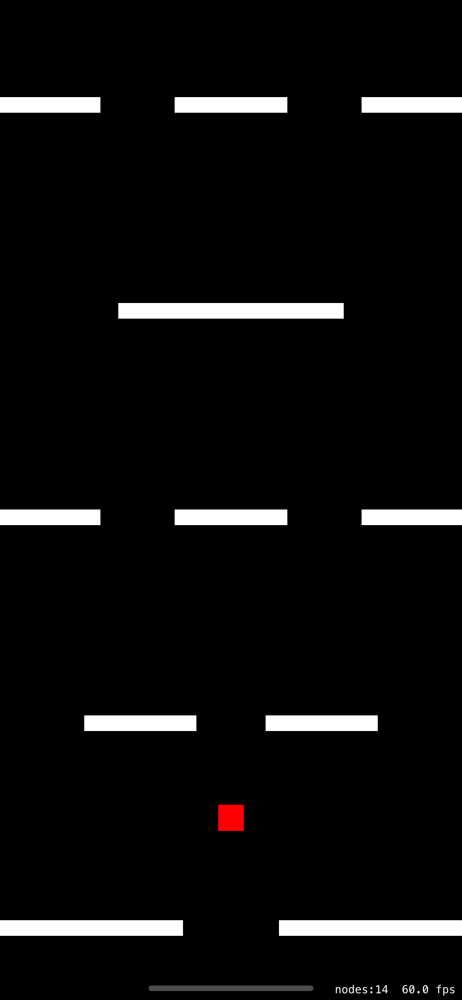

# Hold (the screen to play)

Another simple iOS game written entirely in Swift.

This game was also initially built in 2017 from a game tutorial course.

The game has been upgraded to Swift 5.

## How to play

- Press and hold the screen to split your player into two players.
- Your task is to avoid all of the obstacles.

