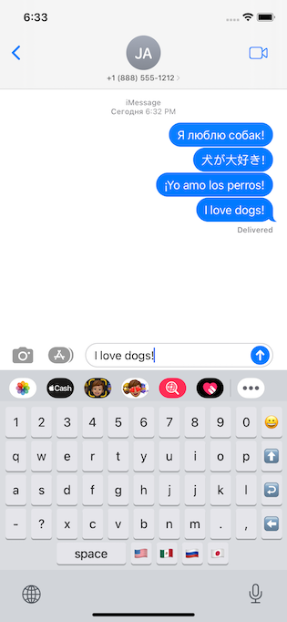

# YoKiboard

This is my implementation of a custom keyboard built with lots of patience, Objective C, and JavaScript.
I built this prototype/keyboard to try something new, and I hope that you enjoy it!

Press the link or the image below to watch the demo!

[Presentation via Loom](https://www.loom.com/share/77a053765f144f5086872fde4f931034)

